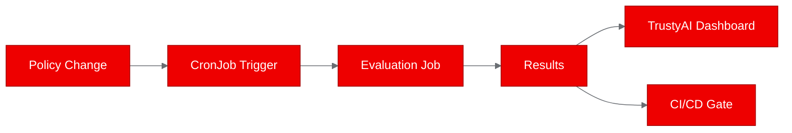

# Image Review -- v1

## Scores

| Dimension | Weight | Score (1-10) | Weighted |
|---|---|---|---|
| Placement rationale | 2x | 4 | 8 |
| Prompt specificity | 2x | 2 | 4 |
| Brand compliance | 2x | 7 | 14 |
| Aspect ratio & sizing | 1x | 3 | 3 |
| Alt text quality | 1x | 2 | 2 |
| Image count | 1x | 3 | 3 |
| **Totals** | | | **34** |

**Normalized score: (34 / 90) * 10 = 3.8 / 10**

---

## Per-Image Feedback

### 1. Mermaid Diagram: Baseline-Candidate Workflow (lines 92-105)

**Strengths:**
- Well-placed immediately after the results table and the discussion of the candidate scenario failure. It illustrates the architectural insight about shared state, which is the most important takeaway from the PoC.
- Diagram type (flowchart) is appropriate for showing the iterative policy-edit workflow.
- The `%%{init}%%` theme block is present with correct Red Hat brand variables: `primaryColor: '#EE0000'`, `primaryBorderColor: '#A30000'`, `lineColor: '#6A6E73'`, `secondaryColor: '#F0F0F0'`, `tertiaryColor: '#0066CC'`. This is solid brand compliance.
- The diagram is readable and accurate -- it correctly shows the feedback loop and the PVC dependency.

**Weaknesses:**
- No alt text or caption. Screen readers cannot interpret Mermaid diagrams. Add a descriptive caption like: *"Figure 1: Policy evaluation workflow showing how a PersistentVolumeClaim enables shared state between baseline and candidate Kubernetes Jobs."*
- The node labels are terse (e.g., "Policy.md<br/>Define Rules"). Consider slightly more descriptive labels for clarity outside the diagram context.

---

## Missing Image Opportunities

The draft has five substantial sections but only one visual. Several sections would benefit significantly from diagrams or image placeholders:

### A. Hero Image (before section 1)
The post has no hero image. A Red Hat Developer Blog post needs a 16:9 hero visual. Suggested placeholder:

```

```

### B. Architecture Overview (section 2: "Why AI safety evaluation belongs on your platform")
This section describes how guardrail evaluation fits into the platform but is entirely text. A Mermaid diagram or image showing the integration points (Kubernetes Jobs, TrustyAI dashboards, CI/CD pipelines, CronJobs) would make the four bullet points concrete. Suggested Mermaid:



### C. Dockerfile Build Flow (section 3: "Containerizing for OpenShift")
The Dockerfile code block is clear, but a simple diagram showing the image layers (UBI-minimal base -> Python install -> app code -> config files -> non-root user) would help readers unfamiliar with multi-layer container builds. This is a good candidate for a Mermaid diagram.

### D. Job Execution Sequence (section 4: "Deploying and running the evaluation")
The four scenarios are listed as a numbered list. A Mermaid sequence diagram showing the temporal order and dependencies between the four Jobs would make the ephemeral-state problem (revealed in results) visually obvious before the reader even gets to the failure discussion.

### E. Results Table Enhancement
The results table at lines 81-87 is functional but could benefit from a visual summary -- a simple bar chart placeholder or a status diagram showing 3 green / 1 red would add immediate visual impact.

---

## Summary

The draft has exactly one visual (a well-crafted Mermaid diagram) in a ~1200-word post with six sections. This is insufficient for a developer blog post. The single diagram is well-placed and brand-compliant, but the post relies almost entirely on code blocks and text to convey concepts that would benefit from visual communication.

**Critical fixes needed:**
1. Add a hero image placeholder (16:9, brand colors, descriptive alt text)
2. Add at least 2 more diagrams -- the platform integration overview (section 2) and the Job execution sequence (section 4) are the highest-value additions
3. Add alt text / captions to the existing Mermaid diagram and any new visuals
4. Ensure all image placeholders include aspect ratios, brand color references, and descriptive generation prompts

**What works well:**
- The existing Mermaid diagram is the right visual for the right place
- Brand color theming in the `%%{init}%%` block is correct and complete
- The diagram type choice (flowchart) is appropriate

With 3-4 well-placed visuals and proper alt text, this post would score significantly higher.
