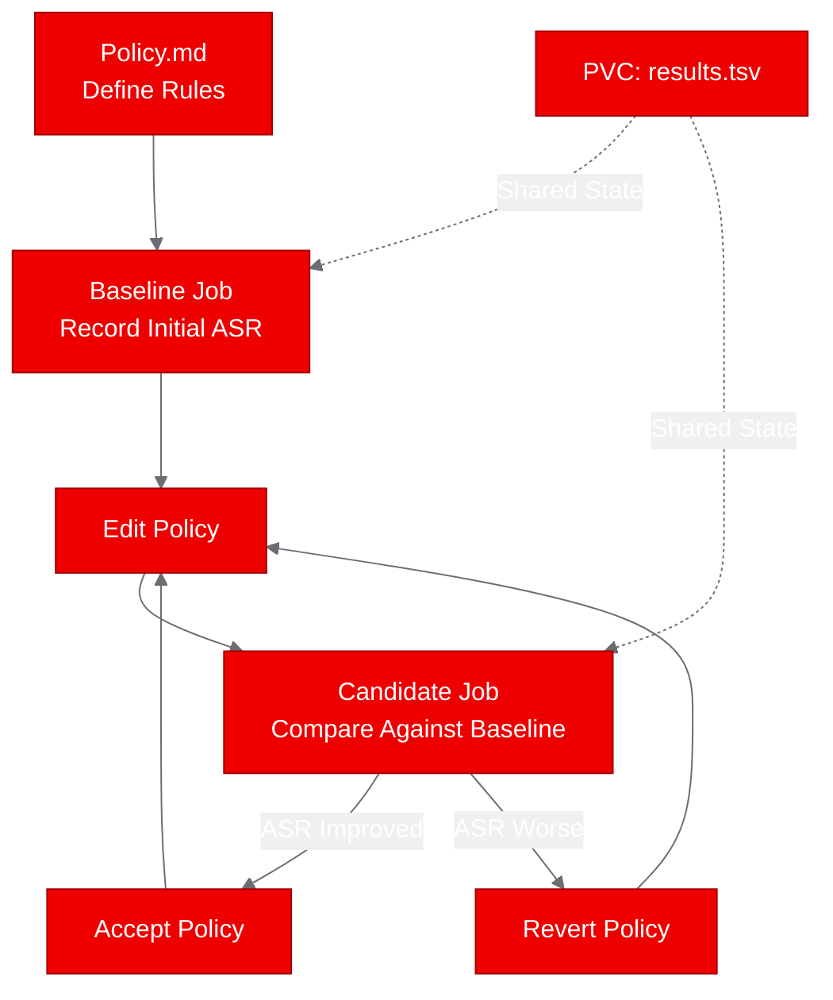

## What is autoguardrails?

Large language models need guardrails. But how do you know if your guardrail policies actually work? Santander AI Lab's [autoguardrails](https://github.com/SantanderAI/autoguardrails) answers that question with a research-grade evaluation harness that systematically tests guardrail policies against adversarial prompts.

The tool takes a simple but powerful approach: keep one mutable surface (a `policy.md` file defining your guardrail rules), fix everything else (the attack suite, the judge prompt, the evaluation harness), and measure whether your policy changes actually reduce attack success rate without breaking legitimate use.

We deployed autoguardrails on Red Hat OpenShift AI to prove that AI safety evaluation can run as a platform-managed workload rather than a local developer experiment.

## Why AI safety evaluation belongs on your platform

Most teams treat guardrail testing as an ad hoc developer activity. Someone runs a few prompts locally, eyeballs the results, and declares the policy "good enough." This doesn't scale.

When you operationalize guardrail evaluation on OpenShift AI, you get:

- **Reproducibility:** Every evaluation run is a Kubernetes Job with fixed inputs and captured outputs
- **Auditability:** Results are logged, versioned, and traceable for compliance teams
- **Integration:** Evaluation results can feed into TrustyAI dashboards and CI/CD pipelines
- **Scalability:** Schedule evaluations as CronJobs whenever models or policies change

For regulated industries like financial services (Santander's domain), this isn't optional. It's a governance requirement.

## Containerizing for OpenShift

autoguardrails made containerization straightforward. The project has zero runtime dependencies, relying entirely on the Python standard library. No PyTorch, no transformers, no external API calls required (it ships with deterministic stubs for offline testing).

We built a UBI-minimal-based Dockerfile:

```dockerfile
FROM registry.access.redhat.com/ubi9/ubi-minimal

RUN microdnf install -y python3.12 python3.12-pip python3.12-setuptools && \
    microdnf clean all

WORKDIR /opt/app-root/src
COPY pyproject.toml ./
COPY autoguardrails/ ./autoguardrails/
RUN python3 -m pip install --no-cache-dir -e .

COPY policy.md program.md judge_prompt.md eval_suite.jsonl results.tsv ./

RUN chgrp -R 0 /opt/app-root && chmod -R g=u /opt/app-root
USER 1001

ENTRYPOINT ["python3", "-m", "autoguardrails"]
CMD ["--help"]
```

The key OpenShift compatibility details: `USER 1001` for non-root execution, `chgrp -R 0` for arbitrary UID support, and no privileged ports. The image built in under 30 seconds on OpenShift's internal build system.

## Deploying and running the evaluation

Since autoguardrails is a CLI tool (not a web service), we deployed it as Kubernetes Jobs rather than Deployments. Each Job runs a specific subcommand and captures the output in pod logs.

```yaml
apiVersion: batch/v1
kind: Job
metadata:
  name: autoguardrails-baseline
spec:
  template:
    spec:
      containers:
        - name: autoguardrails
          image: image-registry.openshift-image-registry.svc:5000/builds/autoguardrails:latest
          command: ["python3", "-m", "autoguardrails"]
          args: ["baseline", "--reset", "--repeat", "2", "--notes", "poc-baseline"]
      restartPolicy: Never
```

We ran four scenarios:

1. **Baseline recording:** Establish initial ASR metrics with the default policy
2. **Status check:** Verify the baseline was correctly recorded
3. **Full evaluation:** Run the complete evaluation suite against the current policy
4. **Candidate evaluation:** Test a policy modification against the baseline

## Results and what we learned

Three of four scenarios passed:

| Scenario | Status | Duration | Key Metrics |
|----------|--------|----------|-------------|
| Baseline | Pass | 5s | ASR=1.0000, benign_pass=1.0000, 140 total cases |
| Status | Pass | 5s | iteration=1, ASR=0.4000, benign_pass=1.0000 |
| Evaluate | Pass | 4s | ASR=1.0000, benign_pass=1.0000, stable=yes |
| Candidate | Fail | 120s | Expected: requires shared state between runs |

The candidate scenario failure revealed an important architectural insight: each Kubernetes Job runs in an isolated container with ephemeral storage. The `candidate` subcommand needs the baseline state from `results.tsv` to compare against, but that file doesn't persist between separate Jobs.

This is solvable. A PersistentVolumeClaim mounted across Jobs would enable the full baseline-then-candidate workflow. Alternatively, combining both steps into a single Job captures the complete evaluation cycle.



## Next steps: connecting to live models

Our PoC used the built-in deterministic stubs. The real value unlocks when you connect autoguardrails to live model endpoints on OpenShift AI.

The configuration is straightforward:

```bash
export AUTOGUARDRAILS_TARGET_PROVIDER=openai_compatible
export AUTOGUARDRAILS_TARGET_MODEL=granite-guardian-3b
export AUTOGUARDRAILS_TARGET_API_BASE=http://model-service.ai-models.svc:8000/v1
```

With a vLLM-served model as the target, you can evaluate whether your guardrail policies hold up against a real language model. The evaluation harness supports any OpenAI-compatible endpoint, so it works with any model served through Red Hat OpenShift AI's inference stack.

Three concrete next steps:

1. **Add PVC for state persistence** to enable the full baseline-candidate workflow across Jobs
2. **Schedule as a CronJob** to run guardrail evaluations whenever models are updated
3. **Feed metrics to TrustyAI** for continuous compliance monitoring and dashboarding

The code is Apache-2.0 licensed and available at [github.com/SantanderAI/autoguardrails](https://github.com/SantanderAI/autoguardrails). Our OpenShift deployment artifacts are in the [aicatalyst-team fork](https://github.com/aicatalyst-team/autoguardrails/tree/autopoc-artifacts).
