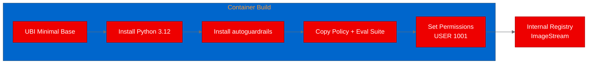
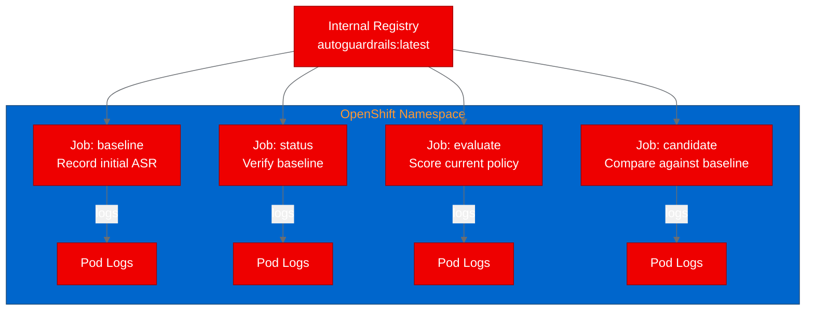
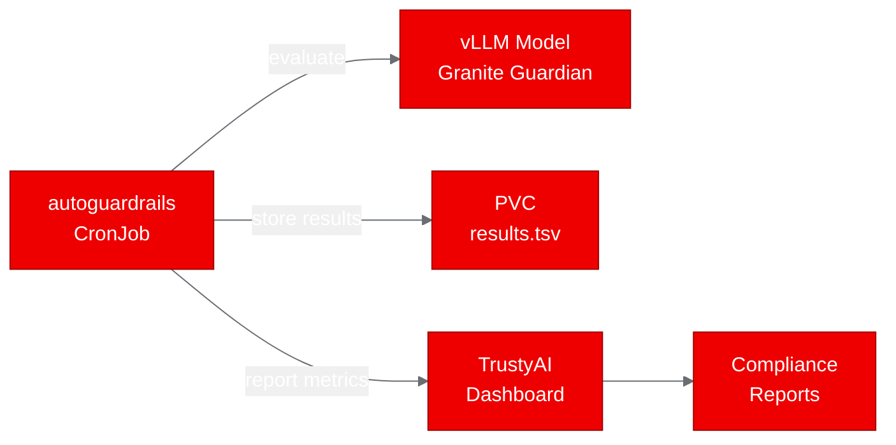

## Deploying AI safety guardrails on Red Hat OpenShift AI with autoguardrails

Ad hoc guardrail testing doesn't scale. When teams evaluate LLM safety policies by running a few prompts locally and eyeballing the results, they get neither reproducibility nor audit trails. We deployed Santander AI Lab's [autoguardrails](https://github.com/SantanderAI/autoguardrails) on [Red Hat OpenShift AI](https://www.redhat.com/en/technologies/cloud-computing/openshift/openshift-ai) to prove that AI safety evaluation can run as a platform-managed workload, giving compliance teams the reproducible, containerized guardrail testing they need.

--------------------
**[Image Placeholder 1: Hero image showing AI safety guardrail concept]**

**Placement rationale**: Opening visual to establish the AI safety theme before the technical content begins.
**Image generation prompt**: A clean, modern illustration of a shield protecting a neural network, using Red Hat brand colors (#EE0000 for the shield, #151515 for the network nodes, #F0F0F0 background). Flat design style, 16:9 aspect ratio, no text overlay.
**Alt text**: A protective shield icon over a stylized neural network, representing AI safety guardrails protecting language model outputs.

--------------------

## What is autoguardrails?

autoguardrails is a research-grade evaluation harness that systematically tests guardrail policies against adversarial prompts. The approach is deliberately narrow: keep one mutable surface (a policy.md file defining your guardrail rules), fix everything else (the attack suite, the judge prompt, the evaluation harness), and measure whether policy changes actually reduce attack success rate (ASR) without breaking legitimate use.

ASR measures the fraction of adversarial prompts that bypass your guardrails. Lower is better. The harness also tracks benign pass rate to ensure the system doesn't win by refusing everything.

The project is built entirely on the Python standard library with zero runtime dependencies. It ships with deterministic stubs for offline testing, and it can connect to any OpenAI-compatible endpoint for real model evaluation.

## Why AI safety evaluation belongs on your platform

When you operationalize guardrail evaluation on [Red Hat OpenShift AI](https://www.redhat.com/en/technologies/cloud-computing/openshift/openshift-ai), you get four things that local testing can't provide:

- **Reproducibility:** Every evaluation run is a Kubernetes Job with fixed inputs and captured outputs.
- **Auditability:** Results are logged, versioned, and traceable for compliance teams.
- **Integration:** Evaluation results can feed into [TrustyAI](https://www.redhat.com/en/technologies/cloud-computing/openshift/openshift-ai) dashboards and CI/CD pipelines.
- **Scalability:** Schedule evaluations as CronJobs whenever models or policies change.

For regulated industries like financial services, this isn't optional. It's a governance requirement.

> **Ready to explore AI safety on OpenShift?** [Get started with Red Hat OpenShift AI](https://www.redhat.com/en/technologies/cloud-computing/openshift/openshift-ai) to run your own guardrail evaluations.

## Containerizing for OpenShift

autoguardrails made containerization straightforward. Zero runtime dependencies means no PyTorch, no transformers, and no external API calls required for the default stub mode.

We built a Red Hat Universal Base Image (UBI) minimal Dockerfile:

```dockerfile
FROM registry.access.redhat.com/ubi9/ubi-minimal

RUN microdnf install -y python3.12 python3.12-pip python3.12-setuptools && \
    microdnf clean all

WORKDIR /opt/app-root/src
COPY pyproject.toml autoguardrails/ ./
RUN python3 -m pip install --no-cache-dir .

COPY policy.md program.md judge_prompt.md eval_suite.jsonl results.tsv ./

RUN chgrp -R 0 /opt/app-root && chmod -R g=u /opt/app-root
USER 1001

ENTRYPOINT ["python3", "-m", "autoguardrails"]
```

The key OpenShift compatibility details: USER 1001 for non-root execution, chgrp -R 0 for arbitrary UID support, and no privileged ports. The image built in under 30 seconds on OpenShift's internal build system.


*Figure 1: Container build pipeline using UBI minimal as the base image.*

## Deploying and running the evaluation

Since autoguardrails is a command-line interface (CLI) tool, we deployed it as Kubernetes Jobs rather than Deployments. Each Job runs a specific subcommand and captures the output in pod logs.

```yaml
apiVersion: batch/v1
kind: Job
metadata:
  name: autoguardrails-baseline
spec:
  template:
    spec:
      containers:
        - name: autoguardrails
          image: image-registry.openshift-image-registry.svc:5000/builds/autoguardrails:latest
          command: ["python3", "-m", "autoguardrails"]
          args: ["baseline", "--reset", "--repeat", "2"]
      restartPolicy: Never
```


*Figure 2: Deployment topology showing four Jobs pulling from the internal registry.*

We ran 4 scenarios: baseline recording, status check, full evaluation, and candidate comparison.

## Results and what we learned

3 of 4 scenarios passed:

| Scenario | Status | Duration | Key Metrics |
|----------|--------|----------|-------------|
| Baseline | Pass | 5s | ASR=1.00 (stubs pass all attacks), benign_pass=1.00, 140 total cases |
| Status | Pass | 5s | iteration=1, ASR=0.40, benign_pass=1.00 |
| Evaluate | Pass | 4s | ASR=1.00, benign_pass=1.00, stable=yes |
| Candidate | Fail | 120s | Requires shared state between runs |

The ASR of 1.00 from the deterministic stubs is expected: the stub model passes every prompt through without filtering, so all 100 attack cases succeed. In a real deployment with a live model and tuned policy, you'd see ASR drop as the guardrails catch adversarial prompts.

The candidate scenario failure revealed an important architectural insight. Each Kubernetes Job runs in an isolated container with ephemeral storage. The candidate subcommand needs the baseline state from results.tsv to compare against, but that file doesn't persist between separate Jobs. A PersistentVolumeClaim (PVC) mounted across Jobs would solve this, or you could combine both steps into a single Job.

> **Want to see how Red Hat approaches AI safety?** [Learn about TrustyAI on OpenShift AI](https://www.redhat.com/en/technologies/cloud-computing/openshift/openshift-ai) for enterprise-grade responsible AI monitoring.

## What comes next: connecting to live models

Our proof of concept used the built-in deterministic stubs. The real value would unlock when connecting autoguardrails to live model endpoints on OpenShift AI. We haven't tested this yet, but the configuration path is clear:

```bash
export AUTOGUARDRAILS_TARGET_PROVIDER=openai_compatible
export AUTOGUARDRAILS_TARGET_MODEL=granite-guardian-3b
export AUTOGUARDRAILS_TARGET_API_BASE=http://model-service.ai-models.svc:8000/v1
```

With a vLLM-served model as the target, you could evaluate whether your guardrail policies hold up against a real language model. The evaluation harness supports any OpenAI-compatible endpoint, so it works with any model served through the Red Hat OpenShift AI inference stack.

3 concrete next steps we'd recommend:

1. **Add a PVC for state persistence** to enable the full baseline-then-candidate workflow across Jobs
2. **Schedule as a CronJob** to run guardrail evaluations whenever models are updated
3. **Feed metrics to TrustyAI** for continuous compliance monitoring and dashboarding


*Figure 3: Projected production architecture connecting autoguardrails to live model serving and TrustyAI.*

The code is Apache-2.0 licensed and available at [github.com/SantanderAI/autoguardrails](https://github.com/SantanderAI/autoguardrails). Our OpenShift deployment artifacts are in the [aicatalyst-team fork](https://github.com/aicatalyst-team/autoguardrails/tree/autopoc-artifacts).

> **Try it yourself.** Clone the [autoguardrails repository](https://github.com/SantanderAI/autoguardrails), build the UBI container image, and deploy it as a Job on your [Red Hat OpenShift AI](https://www.redhat.com/en/technologies/cloud-computing/openshift/openshift-ai) cluster.
